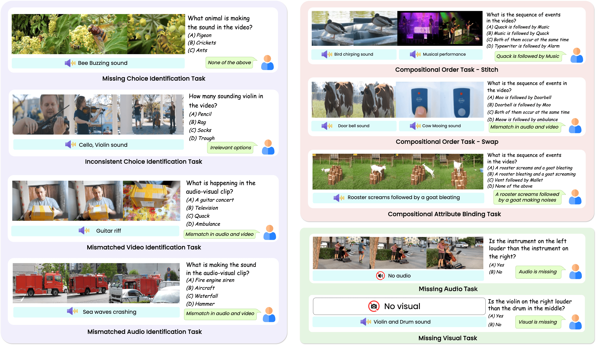
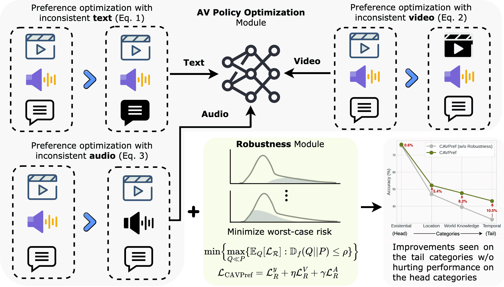

<div align="center">
  <h1>AVTrustBench: Assessing and Enhancing Reliability and Robustness in Audio-Visual LLMs</h1>
  <h2><i>(Accepted to ICCV 2025)</i></h2>
</div>
  
<!-- **Authors:** -->

<div align="center">
  
<b>_<sup>1*</sup> [Sanjoy Chowdhury](https://schowdhury671.github.io/), <sup>2,3*</sup> [Sayan Nag](https://sayannag.github.io/), <sup>4</sup> [Subhrajyoti Dasgupta](https://subhrajyotidasgupta.github.io/), <sup>5</sup> [Yaoting Wang](https://github.com/schowdhury671/avtrustbench-/),_</b>

**_<sup>5</sup> [Mohamed Elhoseiny](https://www.mohamed-elhoseiny.com/), <sup>1</sup> [Ruohan Gao](https://ruohangao.github.io/), <sup>1</sup> [Dinesh Manocha](https://www.cs.umd.edu/people/dmanocha/)_**

<!-- **Affiliations:** -->

_<sup>1</sup> University of Maryland, <sup>2</sup> University of Toronto, <sup>3</sup> Adobe Research, <sup>4</sup> Mila and Université de Montréal, <sup>5</sup> KAUST_
</div>

## TL;DR
We introduce **AVTrustBench** — a comprehensive 600K-sample benchmark 📊 evaluating AVLLMs on adversarial attacks 🛡️⚔️, compositional reasoning 🧩🧠, and modality-specific dependencies 🎧👁️.

We further propose a new model-agnostic calibrated audio-visual preference optimization-based training strategy, **CAVPref**, that improves the performance of existing AVLLMs by up to _30.19%_ 🚀📈.

<div align="center">
  📰 <a href="https://arxiv.org/abs/2501.02135" style="color: black; text-decoration: underline;text-decoration-style: dotted;">Paper</a>    :card_file_box:  <a href="https://umd0-my.sharepoint.com/:f:/g/personal/sanjoyc_umd_edu/Eokp3KD2UvxAgiCPtXePyXIBEVpbYtgOSnXcTvQWcSgLYQ?e=HaMYDC" style="color: black; text-decoration: underline;text-decoration-style: dotted;">Dataset</a>   🌐  <a href="https://schowdhury671.github.io/avtrustbench_project/" style="color: black; text-decoration: underline;text-decoration-style: dotted;">Project Page</a>    :bricks: <a href="https://github.com/schowdhury671/avtrustbench-/" style="color: black; text-decoration: underline;text-decoration-style: dotted;">Code</a>   
</div>


## Table of Contents 📚

- [AVTrustBench Statistics and AVLLMs Leaderboard](#avtrustbench-statistics-and-avllms-leaderboard-)
- [AVTrustBench Task Examples](#avtrustbench-task-examples-)
- [CAVPref Usage](#usage)
- [Dataset](#dataset-)
- [Results](#results-)
- [TO-DO](#to-do-)

## AVTrustBench Statistics and AVLLMs Leaderboard 📊
<div align="center">
  
</div>


## AVTrustBench Task Examples 🔍🎧🧠
<div align="center">
  
</div>


## CAVPref Architecture and Usage 🛠️
### Architecture
<div align="center">
  
</div>

### Usage
CAVPref module has been designed to be utilized with your AVLLM. Here’s an example **CAVPref** usage:

First, make sure you have your audio–visual LLM and data batches ready:

1. Install dependencies:  
   ```sh
   pip install torch transformers
   ```

2. Import and initialize the preference module:  
   ```python
   from utils.cavpref import CAVPref   # filepath: utils/cavpref.py

   # Initialize with custom modality weights if needed
   cavpref = CAVPref(lambdas={"T": 1.0, "V": 1.0, "A": 0.8})
   ```

3. Prepare one batch of paired examples:
   - **T**: Dict with `"winning"` and `"losing"` text inputs (each containing `input_ids`, `attention_mask`, `labels`).
   - **V**: Dict with `"winning"` and `"losing"` visual tensors.
   - **A**: Dict with `"winning"` and `"losing"` audio tensors.

4. Compute the preference loss:
   ```python
   # Example batch (you must supply real tensors here)
   T_batch = {
       "winning": { "input_ids": ..., "attention_mask": ..., "labels": ... },
       "losing":  { "input_ids": ..., "attention_mask": ..., "labels": ... }
   }
   V_batch = { "winning": vision_tensors_win, "losing": vision_tensors_loss }
   A_batch = { "winning": audio_tensors_win,  "losing": audio_tensors_loss }

   loss = cavpref(
       avllm, 
       T=T_batch, 
       V=V_batch, 
       A=A_batch, 
       betas={"T":0.1, "V":0.1, "A":0.1}, 
       task_name="MVIT"
   )
   ```

5. Backpropagate and update your model:
   ```python
   loss.backward()
   optimizer.step()
   optimizer.zero_grad()
   ```

For more details, see the implementation of `utils/cavpref.py`.


## Dataset 📁

1. **Downloading dataset:** 
   - Please download the dataset JSONs from here: [Sharepoint Link]([https://umd0-my.sharepoint.com/:f:/g/personal/sanjoyc_umd_edu/Eokp3KD2UvxAgiCPtXePyXIBEVpbYtgOSnXcTvQWcSgLYQ?e=HVIMYp](https://umd0-my.sharepoint.com/:f:/g/personal/sanjoyc_umd_edu/Eokp3KD2UvxAgiCPtXePyXIBEVpbYtgOSnXcTvQWcSgLYQ?e=HaMYDC))

2. **Dataset details** (Under Construction 🚧)

## Results 📉
<div align="center">
  
</div>


## TO-DO 📝
- [x] CAVPref Module and Example Usage
- [x] AVTrustBench Construction
- [x] AVTrustBench Upload
- [ ] Add AVTrustBench-test
- [ ] Add AVTrustBench dataset details


## Citation

```bibtex
@inproceedings{chowdhury2025avtrustbench,
      title={AVTrustBench: Assessing and Enhancing Reliability and Robustness in Audio-Visual LLMs},
      author={Chowdhury, Sanjoy and Nag, Sayan and Dasgupta, Subhrajyoti and Wang, Yaoting and Elhoseiny, Mohamed and Gao, Ruohan and Manocha, Dinesh},
      journal={International Conference on Computer Vision (ICCV)},
      year={2025}
}
```
